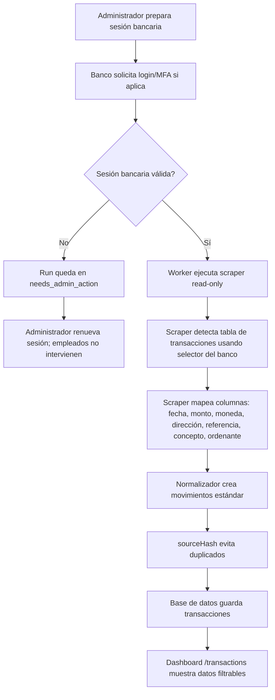

# Guía operativa del scraper bancario RD-Sync

Esta guía explica, paso a paso, cómo debe operar RD-Sync desde el inicio de sesión bancario hasta la visualización de transacciones. Está escrita para una persona sin contexto técnico: si algo falla, la respuesta correcta no es improvisar, es seguir el flujo y escalar al administrador.

## Respuesta corta

| Pregunta | Respuesta |
|---|---|
| ¿Dónde inicia sesión el empleado al banco? | En ningún lugar. El empleado nunca debe entrar al banco ni ver MFA, credenciales, cookies o sesiones. |
| ¿Dónde inicia sesión el administrador al banco? | En un flujo administrativo separado de sesión bancaria. En el MVP actual todavía no existe una pantalla final para capturar credenciales bancarias dentro de RD-Sync. |
| ¿Qué existe hoy? | Dashboard de transacciones, pantalla admin de estado de scraping, perfiles read-only de extracción y cola/procesador de ingestión. |
| ¿Cómo sabe el scraper qué extraer? | Por un perfil por banco: selector de filas, selector de MFA y mapa de columnas. |
| ¿Qué pasa si el banco pide MFA? | El scraper se detiene y marca el run como `needs_admin_action`. Solo un administrador debe renovar la sesión. |

## Rutas del MVP actual

| Uso | Ruta | Quién la usa |
|---|---|---|
| Home de demo local | `/` | Cualquier usuario local durante pruebas. |
| Ver transacciones recientes | `/transactions` | Empleado con rol `viewer` o `reviewer`. |
| Ver salud de scraping | `/admin/scrape-runs` | Solo administrador. |
| Preview admin local | `/admin/scrape-runs?previewRole=admin` | Solo desarrollo local con `RD_SYNC_DEV_PREVIEW=enabled`. |

> Importante: si abres `/admin/scrape-runs` directamente sin autenticación admin o sin preview local, verás `Admin access required`. Eso es correcto.

## Flujo completo de punta a punta



## Roles y responsabilidades

### Empleado

El empleado solo hace esto:

1. Abre `/transactions`.
2. Filtra por banco, monto, referencia, concepto u ordenante.
3. Verifica si la transacción aparece.
4. Si no aparece, avisa a un administrador.

El empleado nunca debe:

- Entrar al banco.
- Manejar MFA.
- Ver contraseñas.
- Ver cookies, tokens o capturas del portal bancario.
- Ejecutar scraping manual.
- Tocar rutas de admin.

### Administrador

El administrador hace esto:

1. Revisa `/admin/scrape-runs`.
2. Si un run aparece como `needs_admin_action`, revisa el resumen seguro.
3. Renueva la sesión bancaria desde un equipo autorizado.
4. Reintenta el run después de que la sesión esté válida.

El administrador tampoco debe pegar contraseñas en logs, tickets, chats o notas operativas.

## ¿Dónde se inicia sesión al banco?

### Estado actual del MVP

Hoy no hay una pantalla productiva de RD-Sync donde se escriban credenciales bancarias. Esto es intencional en el MVP: meter credenciales bancarias antes de tener aislamiento, cifrado, auditoría y manejo correcto de sesiones sería construir la bóveda antes de ponerle puerta.

Lo que sí existe:

- Scraper read-only para recolectar transacciones de una página ya autenticada.
- Detección de MFA mediante `mfaIndicatorSelector`.
- Estado `needs_admin_action` cuando la sesión requiere intervención.
- Pantalla admin para ver la salud de scraping.
- Dashboard de empleados sin controles bancarios.

### Flujo productivo recomendado

El login bancario debe vivir en un módulo admin aislado, no en el dashboard de empleados.

Flujo recomendado:

1. Un administrador autorizado inicia una sesión bancaria en un navegador controlado.
2. Si el banco pide MFA, el administrador completa el MFA manualmente.
3. RD-Sync guarda una referencia cifrada de la sesión, no la contraseña.
4. El worker usa esa sesión para abrir la pantalla de movimientos.
5. El scraper solo lee transacciones.
6. Si la sesión expira, el worker se detiene y pide intervención admin.

## ¿Cómo sabe el scraper dónde está la información?

RD-Sync no adivina. Cada banco necesita un perfil de scraping. Ese perfil le dice al scraper:

| Campo | Para qué sirve |
|---|---|
| `bankId` | Identifica el banco: `popular`, `bhd`, `banreservas`. |
| `accountFingerprint` | Identifica la cuenta sin exponer el número real. |
| `transactionRowSelector` | Selector CSS de cada fila de transacción. |
| `mfaIndicatorSelector` | Selector CSS que indica que el banco está pidiendo MFA o login. |
| `columnMap.postedAt` | De dónde sale la fecha. |
| `columnMap.amount` | De dónde sale el monto. |
| `columnMap.currency` | De dónde sale la moneda. |
| `columnMap.direction` | De dónde sale si es crédito o débito. |
| `columnMap.reference` | De dónde sale la referencia bancaria. |
| `columnMap.concept` | De dónde sale el concepto o descripción. |
| `columnMap.originator` | De dónde sale el ordenante, si el banco lo muestra. |

Ejemplo conceptual:

```ts
const popularProfile = {
  bankId: "popular",
  accountFingerprint: "acct-main",
  transactionRowSelector: "#transactions tbody tr",
  mfaIndicatorSelector: "#otp",
  columnMap: {
    postedAt: "date",
    amount: "amount",
    currency: "currency",
    direction: "direction",
    reference: "reference",
    concept: "concept",
    originator: "originator",
  },
};
```

En producción, cada banco tendrá un adaptador propio porque Banreservas, BHD y Popular no tienen el mismo HTML, textos, navegación ni manejo de sesión.

## Cómo se calibra un banco nuevo

Este trabajo lo debe hacer una persona técnica o un administrador capacitado.

1. Entrar al banco con un usuario autorizado.
2. Abrir la pantalla donde el banco lista movimientos o transacciones.
3. Identificar el selector estable de las filas de movimientos.
4. Identificar qué columna representa fecha, monto, moneda, tipo, referencia, concepto y ordenante.
5. Identificar el selector que aparece cuando el banco pide MFA o sesión vencida.
6. Crear o actualizar el perfil del banco.
7. Probar en modo read-only.
8. Confirmar que no toca botones de pago, transferencia, beneficiarios o aprobaciones.
9. Ejecutar pruebas contra fixture antes de usarlo con datos reales.

## Qué ocurre cuando un run se ejecuta

1. El orquestador agenda un job de ingestión.
2. El worker marca el run como `running`.
3. El scraper revisa si aparece el selector de MFA.
4. Si MFA aparece, el run termina como `needs_admin_action`.
5. Si no hay MFA, el scraper lee las filas de transacciones.
6. El normalizador convierte las filas al formato interno.
7. El sistema calcula `sourceHash` para evitar duplicados.
8. La base de datos guarda nuevas transacciones y salta repetidas.
9. El dashboard muestra las transacciones normalizadas.

## Estados de scraping

| Estado | Significado | Acción |
|---|---|---|
| `queued` | El run está esperando ejecución. | Esperar. |
| `running` | El worker está leyendo datos. | No intervenir. |
| `succeeded` | El run terminó correctamente. | Revisar `/transactions`. |
| `needs_admin_action` | Falta login, MFA o renovación de sesión. | Administrador debe renovar sesión. |
| `failed` | Error técnico o cambio inesperado del portal. | Revisar resumen seguro y escalar a soporte técnico. |

## Reglas de seguridad que no se negocian

- El scraper es read-only.
- No se automatizan pagos, transferencias, beneficiarios ni aprobaciones.
- No se guardan contraseñas en texto plano.
- No se imprimen cookies, tokens, HTML crudo ni capturas bancarias en logs.
- Los empleados no ven operaciones del scraper.
- MFA no se evade; se pausa y lo resuelve un administrador autorizado.

## Lo que falta antes de conectarlo a bancos reales

El MVP todavía necesita estos módulos para operar con bancos reales:

- Módulo admin de sesión bancaria aislada.
- Integración con un proveedor de secretos.
- Persistencia real de sesiones cifradas.
- Adaptadores específicos para Banreservas, BHD y Popular.
- Base de datos runtime conectada al dashboard.
- Botón o scheduler admin para lanzar runs.
- Alertas reales para `needs_admin_action` y `failed`.
- Runbook de recuperación por banco.

## Checklist para una persona no técnica

Antes de decir “no funciona”, revisa esto:

- [ ] ¿Abriste `/transactions` para ver transacciones?
- [ ] ¿Aplicaste filtros correctos?
- [ ] ¿La transacción ocurrió después del último run exitoso?
- [ ] ¿El admin ve `needs_admin_action` en `/admin/scrape-runs`?
- [ ] ¿El banco pidió MFA o sesión vencida?
- [ ] ¿El run terminó como `succeeded`?

Si la respuesta no está clara, escala al administrador. No intentes entrar al banco desde una cuenta no autorizada.

