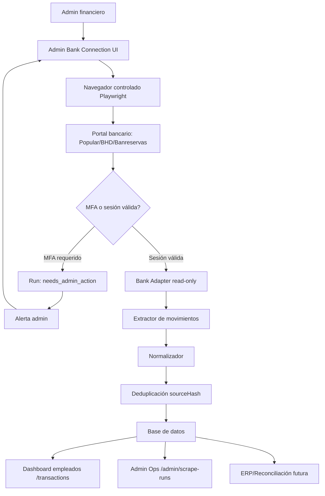
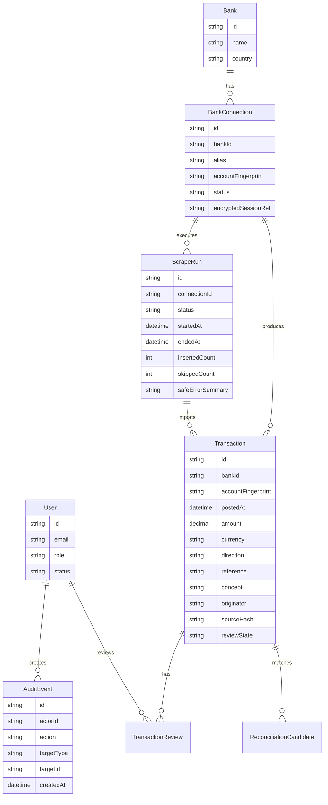

# PRD — RD-Sync Producto Final

Versión: 3.0  
Estado: Product Requirements Document  
Fecha: 2026-06-07  
Producto: RD-Sync  
Audiencia: Dueño del negocio, administración, contabilidad, operaciones, desarrollo y soporte técnico

RD-Sync debe convertirse en un producto operativo para extraer movimientos bancarios de bancos dominicanos sin API pública, mostrar transacciones recientes a empleados autorizados y, cuando el ERP propio esté listo, conectar esas transacciones con conciliación automática. El producto final no se considera exitoso hasta que un administrador pueda conectar al menos un banco real, ejecutar extracción bancaria, guardar transacciones y que un empleado pueda verlas sin entrar al banco.

## 1. Decisión de producto

La prioridad correcta ya no es “tener una base técnica segura”. La prioridad es entregar un flujo real de valor:

```text
Administrador conecta banco → RD-Sync extrae transacciones → Empleado valida pagos en dashboard
```

Todo lo demás existe para proteger y sostener ese flujo.

## 2. Problema

El negocio depende de que el dueño o una persona con acceso bancario valide manualmente si un cliente realizó una transferencia. Esto provoca:

- Interrupciones constantes al dueño.
- Retrasos en liberar pedidos, servicios o comprobantes.
- Riesgo operativo al compartir o concentrar acceso bancario.
- Falta de trazabilidad sobre quién validó qué transacción.
- Pérdida de tiempo porque los empleados no tienen una vista segura y limitada.

Los bancos objetivo —Banreservas, BHD y Banco Popular de República Dominicana— no ofrecen actualmente una API pública simple para este caso de uso privado. Por eso el producto debe soportar scraping bancario controlado, seguro y read-only.

## 3. Objetivos

| Objetivo | Resultado esperado |
|---|---|
| Reducir llamadas al dueño | Empleados autorizados consultan transacciones sin acceso al banco. |
| Extraer movimientos bancarios reales | El sistema obtiene movimientos desde portales bancarios empresariales/personales autorizados. |
| Mantener MFA bajo control admin | MFA nunca se comparte con empleados ni se intenta evadir. |
| Evitar duplicados | Re-ejecutar scraping no duplica transacciones. |
| Dar visibilidad operacional | Admin sabe si el scraper funcionó, falló o necesita intervención. |
| Preparar integración ERP | Cuando el ERP esté listo, las transacciones ya estarán normalizadas para conciliación. |

## 4. No objetivos

RD-Sync no debe:

- Hacer transferencias.
- Crear beneficiarios.
- Pagar servicios.
- Aprobar pagos.
- Exponer saldos completos a empleados.
- Dar acceso directo al portal bancario a empleados.
- Guardar contraseñas en texto plano.
- Evadir MFA, CAPTCHA o medidas de seguridad bancarias.
- Convertirse inicialmente en SaaS multiempresa.

## 5. Usuarios y permisos

| Rol | Quién es | Puede hacer | No puede hacer |
|---|---|---|---|
| Dueño / Super Admin | Propietario del negocio | Configurar bancos, ver todo, aprobar integraciones críticas. | N/A |
| Admin financiero | Persona autorizada a manejar bancos | Iniciar sesión bancaria, completar MFA, ejecutar/reintentar scraping, ver salud operacional. | Ejecutar pagos desde RD-Sync. |
| Supervisor / Reviewer | Encargado de validar pagos | Ver transacciones, marcar vistas/validadas, dejar notas internas. | Ver credenciales, sesiones o MFA. |
| Empleado Viewer | Persona designada para confirmar pagos | Ver dashboard limitado y filtros. | Ver operaciones bancarias, credenciales, scraper o admin. |
| Soporte técnico | Desarrollador/operaciones | Ver errores técnicos redacted, actualizar adaptadores. | Ver secretos bancarios o datos sensibles innecesarios. |

## 6. Definición de producto terminado

El producto final se considera terminado cuando cumple estas condiciones:

- [ ] Un admin puede conectar Banco Popular, BHD y Banreservas.
- [ ] Un admin puede completar MFA manualmente cuando el banco lo pida.
- [ ] El scraper puede extraer movimientos reales de los tres bancos.
- [ ] Las transacciones se guardan de forma persistente.
- [ ] Un empleado puede ver transacciones recientes con filtros útiles.
- [ ] Los empleados no ven saldos, sesiones, credenciales, cookies ni MFA.
- [ ] Los runs de scraping muestran estado, errores seguros y alertas.
- [ ] Los datos no se duplican al reintentar.
- [ ] Existe bitácora de auditoría de accesos y acciones.
- [ ] Cuando el ERP esté listo, se puede activar conciliación contra facturas/cuentas por cobrar.

## 7. Experiencia principal del producto

### 7.1 Flujo feliz: empleado valida pago

1. Cliente realiza transferencia bancaria.
2. RD-Sync ejecuta scraping programado o manual.
3. La transacción se normaliza y guarda.
4. Empleado abre `/transactions`.
5. Empleado filtra por banco, monto, referencia, concepto u ordenante.
6. Empleado confirma si el pago aparece.
7. Reviewer marca la transacción como vista o validada internamente.

### 7.2 Flujo admin: conectar banco

1. Admin entra a `/admin/bank-connections`.
2. Selecciona banco: Popular, BHD o Banreservas.
3. Crea conexión con nombre interno y cuenta/fingerprint.
4. Abre sesión bancaria segura desde RD-Sync.
5. Completa usuario, contraseña y MFA directamente en navegador controlado.
6. RD-Sync guarda referencia cifrada de sesión, no expone secretos al dashboard.
7. Admin ejecuta prueba de extracción read-only.
8. Si se extraen filas válidas, la conexión queda `active`.

### 7.3 Flujo MFA o sesión vencida

1. Worker intenta ejecutar scraping.
2. Banco pide MFA o login.
3. Worker detiene el run.
4. Run queda `needs_admin_action`.
5. Admin recibe alerta.
6. Admin renueva sesión en flujo admin.
7. Admin reintenta run.
8. Worker continúa extracción.

### 7.4 Flujo técnico: banco cambia UI

1. Worker ejecuta scraping.
2. Selector de transacciones falla.
3. Run queda `failed`.
4. Sistema guarda error seguro sin HTML crudo, cookies ni credenciales.
5. Admin ve error en `/admin/scrape-runs`.
6. Soporte técnico actualiza perfil/adaptador del banco.
7. Se ejecuta prueba con fixture antes de reactivar.

### 7.5 Flujo futuro: ERP y conciliación

1. ERP expone facturas/cuentas por cobrar pendientes.
2. RD-Sync compara transacciones contra facturas.
3. Match exacto marca factura como pagada.
4. Match dudoso crea revisión manual.
5. Todo queda auditado.

## 8. Arquitectura de flujo



## 9. Módulos del producto

| Módulo | Propósito | Estado esperado final |
|---|---|---|
| Auth/RBAC | Controlar roles y sesiones de usuarios RD-Sync. | Producción, no trusted headers. |
| Bank Connections | Configurar bancos, cuentas y sesiones. | Admin-only. |
| Browser Session Manager | Manejar navegador, cookies/session refs y expiración. | Aislado y cifrado. |
| Bank Adapters | Navegar y extraer transacciones por banco. | Uno por banco. |
| Scrape Orchestrator | Programar runs, reintentos, locks y DLQ. | BullMQ/Redis o equivalente. |
| Normalization Engine | Convertir datos bancarios a modelo común. | Banco-agnóstico. |
| Transaction Store | Persistir transacciones y evitar duplicados. | PostgreSQL. |
| Employee Dashboard | Mostrar transacciones con filtros seguros. | Usable por no técnicos. |
| Admin Operations | Ver runs, errores, MFA y salud del scraper. | Admin-only. |
| Alerts | Notificar fallos, MFA y cambios de UI. | Email/WhatsApp/Slack según decisión. |
| Audit Trail | Registrar accesos, cambios y eventos críticos. | Inmutable o append-only. |
| ERP Connector | Conciliar contra ERP propio. | Activable cuando el ERP esté listo. |
| Email Parser Fallback | Leer alertas bancarias por email como respaldo. | Fase posterior. |

## 10. Requerimientos funcionales

### FR-001 — Autenticación de usuarios RD-Sync

Prioridad: Must have

El sistema debe permitir login de usuarios internos con roles.

Criterios de aceptación:

- [ ] Usuario puede iniciar sesión en RD-Sync.
- [ ] Rol determina qué rutas puede abrir.
- [ ] Usuario sin rol válido no puede ver transacciones.
- [ ] Admin puede gestionar usuarios internos.
- [ ] Headers spoofeables no son aceptables en producción.

### FR-002 — Gestión de conexiones bancarias

Prioridad: Must have

Admin debe poder crear y administrar conexiones bancarias.

Criterios de aceptación:

- [ ] Admin puede crear conexión para Popular, BHD o Banreservas.
- [ ] Conexión tiene alias visible: “Cuenta principal Popular”.
- [ ] Número de cuenta real no se muestra completo; se usa fingerprint.
- [ ] Conexión puede estar `draft`, `active`, `needs_attention`, `disabled`.
- [ ] Solo admin puede activar/desactivar conexiones.

### FR-003 — Inicio de sesión bancario admin-only

Prioridad: Must have

El login bancario debe ocurrir en un flujo separado del dashboard de empleados.

Criterios de aceptación:

- [ ] Empleado nunca ve formulario de login bancario.
- [ ] Admin puede abrir sesión bancaria en navegador controlado.
- [ ] MFA se completa manualmente por admin.
- [ ] Contraseña no queda en logs ni base de datos en texto plano.
- [ ] Sesión expirada se marca como `needs_admin_action`.

### FR-004 — Adaptador read-only por banco

Prioridad: Must have

Cada banco debe tener un adaptador que navegue hasta la pantalla de movimientos y extraiga filas.

Criterios de aceptación:

- [ ] Existe adaptador para Banco Popular.
- [ ] Existe adaptador para BHD.
- [ ] Existe adaptador para Banreservas.
- [ ] Adaptador solo lee movimientos.
- [ ] Adaptador rechaza selectores o rutas de pagos, transferencias y beneficiarios.
- [ ] Cambios de UI generan alerta segura.

### FR-005 — Calibración de selectores

Prioridad: Must have

El equipo técnico debe poder actualizar selectores por banco sin reescribir todo el scraper.

Criterios de aceptación:

- [ ] Perfil de banco define selector de filas.
- [ ] Perfil define selector de MFA/login requerido.
- [ ] Perfil define mapa de columnas.
- [ ] Cambios se prueban contra fixture antes de producción.
- [ ] No se guardan capturas sensibles sin redacción.

### FR-006 — Ejecución manual de scraping

Prioridad: Must have

Admin debe poder ejecutar scraping manual para una conexión.

Criterios de aceptación:

- [ ] Botón `Run now` visible solo para admin.
- [ ] Run muestra estado en tiempo real o refresh claro.
- [ ] Run exitoso inserta transacciones.
- [ ] Run con MFA queda `needs_admin_action`.
- [ ] Run fallido muestra resumen seguro.

### FR-007 — Scraping programado

Prioridad: Must have

El sistema debe ejecutar scraping automáticamente en intervalos configurables.

Criterios de aceptación:

- [ ] Intervalo configurable por conexión.
- [ ] Default recomendado: cada 15 minutos en horario laboral.
- [ ] Sistema evita runs concurrentes para la misma conexión.
- [ ] Reintentos usan exponential backoff.
- [ ] Después de fallos repetidos, run va a DLQ o estado equivalente.

### FR-008 — Normalización de transacciones

Prioridad: Must have

Los datos extraídos deben convertirse a un modelo común.

Campos mínimos:

- banco
- cuenta/fingerprint
- fecha/hora
- monto
- moneda
- dirección: crédito/débito
- referencia
- concepto
- ordenante, si existe
- hash de origen
- run de origen

Criterios de aceptación:

- [ ] Todos los bancos producen el mismo contrato interno.
- [ ] Monto queda normalizado a decimal.
- [ ] Moneda queda normalizada.
- [ ] Fechas tienen timezone definido.
- [ ] Campos ausentes quedan como `null`, no rompen el proceso.

### FR-009 — Idempotencia y duplicados

Prioridad: Must have

Reintentos no deben duplicar transacciones.

Criterios de aceptación:

- [ ] Cada transacción tiene `sourceHash`.
- [ ] Constraint única evita duplicados.
- [ ] Run reporta insertadas y saltadas.
- [ ] Usuario no ve transacciones duplicadas por refresh.

### FR-010 — Dashboard de transacciones

Prioridad: Must have

Empleado debe ver transacciones recientes sin entrar al banco.

Criterios de aceptación:

- [ ] Ruta `/transactions`.
- [ ] Filtros por banco, monto, fecha, referencia, concepto y ordenante.
- [ ] Vista mobile-friendly.
- [ ] Estado vacío explica qué hacer.
- [ ] No muestra saldos, credenciales, cookies, sesiones ni botones bancarios.
- [ ] Tiempo de carga objetivo menor a 2 segundos para consultas normales.

### FR-011 — Estados de revisión

Prioridad: Should have

Reviewer debe marcar transacciones.

Estados:

- `new`
- `seen`
- `internally_validated`
- `ignored`
- `needs_review`

Criterios de aceptación:

- [ ] Viewer no puede cambiar estado.
- [ ] Reviewer puede cambiar estado.
- [ ] Cambio guarda usuario y timestamp.
- [ ] Cambio crea evento de auditoría.

### FR-012 — Admin operations

Prioridad: Must have

Admin debe ver salud de scraping.

Criterios de aceptación:

- [ ] Ruta `/admin/scrape-runs`.
- [ ] Métricas: runs totales, exitosos, fallidos, pendientes de MFA.
- [ ] Detalle por run.
- [ ] Resumen de error seguro.
- [ ] Acciones: retry, disable connection, open session renewal.

### FR-013 — Alertas

Prioridad: Must have

Sistema debe avisar cuando necesita intervención.

Criterios de aceptación:

- [ ] Alerta por MFA/sesión expirada.
- [ ] Alerta por cambio de UI.
- [ ] Alerta por tres fallos consecutivos.
- [ ] Alerta no contiene secretos.
- [ ] Canal inicial configurable: email, WhatsApp, Slack o SMS.

### FR-014 — Auditoría

Prioridad: Must have

Eventos críticos deben quedar auditados.

Eventos mínimos:

- login usuario RD-Sync
- vista de transacciones
- cambio de estado de transacción
- creación/edición de conexión bancaria
- inicio de scraping
- éxito/fallo/MFA
- renovación de sesión
- acceso denegado

Criterios de aceptación:

- [ ] Logs son append-only.
- [ ] Metadata sensible se redacta.
- [ ] Admin puede consultar auditoría.
- [ ] Eventos tienen actor, acción, target, fecha y resultado.

### FR-015 — Email parsing fallback

Prioridad: Should have

El sistema debe poder leer alertas bancarias por email como respaldo.

Criterios de aceptación:

- [ ] Conexión a buzón autorizado.
- [ ] Verificación SPF/DKIM/DMARC cuando aplique.
- [ ] Parser por banco/tipo de alerta.
- [ ] Alertas se marcan como fuente secundaria.
- [ ] Conflictos entre scraper y email quedan en revisión.

### FR-016 — ERP connector

Prioridad: Later

Cuando el ERP propio esté listo, RD-Sync debe conciliar pagos.

Criterios de aceptación:

- [ ] API o webhook para enviar transacción validada.
- [ ] Match exacto por monto + referencia/factura/cliente.
- [ ] Match parcial/fuzzy queda en revisión.
- [ ] No actualiza ERP sin regla clara.
- [ ] Todas las acciones quedan auditadas.

## 11. Requerimientos no funcionales

| Categoría | Requisito |
|---|---|
| Seguridad | Cifrado de secretos, RBAC, mínimo privilegio, redacción de logs. |
| Privacidad | Empleados solo ven datos necesarios para confirmar pago. |
| Resiliencia | Reintentos, backoff, DLQ, locks por conexión. |
| Observabilidad | Logs estructurados, métricas de runs, alertas accionables. |
| Mantenibilidad | Adaptadores por banco, perfiles externos, pruebas por fixture. |
| Performance | Dashboard responde en menos de 2 segundos en uso normal. |
| Auditoría | Eventos append-only para acciones críticas. |
| Idempotencia | No duplicar transacciones por reintentos. |
| Recuperación | Backups de base de datos y capacidad de desactivar scraper por banco. |
| Seguridad bancaria | Ningún flujo de dinero en RD-Sync. Solo lectura. |

## 12. Pantallas requeridas

| Pantalla | Ruta sugerida | Prioridad | Propósito |
|---|---|---|---|
| Login RD-Sync | `/login` | Must | Autenticación interna. |
| Home | `/` | Must | Navegación clara por rol. |
| Transacciones | `/transactions` | Must | Dashboard empleado. |
| Detalle de transacción | `/transactions/:id` | Should | Ver metadata segura y auditoría básica. |
| Conexiones bancarias | `/admin/bank-connections` | Must | Administrar bancos/cuentas. |
| Nueva conexión | `/admin/bank-connections/new` | Must | Crear conexión. |
| Sesión bancaria | `/admin/bank-connections/:id/session` | Must | Login/MFA admin-only. |
| Runs de scraping | `/admin/scrape-runs` | Must | Salud operacional. |
| Detalle de run | `/admin/scrape-runs/:id` | Should | Diagnóstico seguro. |
| Auditoría | `/admin/audit` | Should | Eventos críticos. |
| Configuración | `/admin/settings` | Should | Intervalos, alertas, canales. |
| Conciliación ERP | `/reconciliation` | Later | Match contra ERP. |

## 13. Modelo conceptual de datos



## 14. Métricas de éxito

| Métrica | Meta |
|---|---|
| Tiempo de detección de transferencia | Menos de 20 minutos. |
| Duplicados | 0 duplicados visibles. |
| Disponibilidad dashboard | 99% en horario operativo. |
| Tiempo de validación empleado | Menos de 1 minuto por consulta. |
| Intervenciones al dueño | Reducir al menos 80%. |
| Incidentes de credenciales | 0. |
| Bancos soportados final | Popular, BHD, Banreservas. |
| STP futuro con ERP | Mayor a 90% para pagos con referencia clara. |

## 15. Riesgos y mitigaciones

| Riesgo | Impacto | Mitigación |
|---|---|---|
| Banco cambia HTML | Scraper falla. | Adaptadores por banco, fixtures, alertas, fallback email. |
| Sesión expira | No hay datos nuevos. | `needs_admin_action`, alerta admin, renovación manual. |
| MFA frecuente | Operación lenta. | Sesiones persistentes seguras, horario de runs, usuario autorizado. |
| Bloqueo por comportamiento automatizado | Scraper inestable. | Frecuencia conservadora, no scraping agresivo, IP estable si es posible. |
| Exposición de credenciales | Riesgo crítico. | Secret manager, cifrado, logs redacted, admin-only. |
| Usuario interpreta mal datos | Decisiones incorrectas. | Estados claros, timestamp, banco, referencia, filtros y notas. |
| Empleado intenta acceder a admin | Riesgo de seguridad. | RBAC, auditoría, acceso denegado. |
| ERP no está listo | Conciliación bloqueada. | Mantener RD-Sync independiente y API-ready. |

## 16. Roadmap recomendado

### Hito 1 — Producto usable con datos simulados persistentes

Objetivo: El dashboard debe sentirse como producto real aunque todavía no conecte banco.

Entregables:

- Persistencia PostgreSQL real.
- Seed/demo data controlado.
- Login RD-Sync real.
- Roles admin/viewer/reviewer.
- Navegación clara.
- Dashboard con transacciones visibles.

Definition of Done:

- [ ] Usuario puede iniciar sesión.
- [ ] Empleado ve transacciones demo persistentes.
- [ ] Reviewer marca transacción.
- [ ] Admin ve operaciones.
- [ ] Tests E2E cubren flujo completo.

### Hito 2 — Conexión real a un banco

Objetivo: Conectar un banco real de punta a punta.

Banco recomendado inicial: Banco Popular, salvo que el negocio confirme otro como prioridad.

Entregables:

- `/admin/bank-connections`.
- Flujo admin de sesión bancaria.
- Adaptador real para un banco.
- Ejecución manual `Run now`.
- Persistencia de transacciones reales.
- Alertas para MFA/fallo.

Definition of Done:

- [ ] Admin conecta un banco real.
- [ ] Admin completa MFA.
- [ ] Scraper extrae movimientos reales.
- [ ] Empleado ve esos movimientos en `/transactions`.
- [ ] No hay duplicados al reintentar.

### Hito 3 — Robustez operacional

Objetivo: Que el sistema sobreviva uso diario.

Entregables:

- Scheduler por conexión.
- Reintentos/backoff/DLQ.
- Métricas y alertas.
- Auditoría consultable.
- Runbooks por error común.

Definition of Done:

- [ ] Scraping automático funciona por horario.
- [ ] Fallos generan alerta útil.
- [ ] Admin puede reintentar sin soporte técnico.
- [ ] Soporte puede diagnosticar sin ver secretos.

### Hito 4 — Tres bancos dominicanos

Objetivo: Soportar Popular, BHD y Banreservas.

Entregables:

- Adaptador Popular.
- Adaptador BHD.
- Adaptador Banreservas.
- Fixtures por banco.
- Pruebas de selector por banco.

Definition of Done:

- [ ] Los tres bancos extraen movimientos.
- [ ] Cada banco tiene runbook.
- [ ] Cambios de UI se detectan temprano.

### Hito 5 — Email fallback

Objetivo: Tener respaldo cuando scraping falle.

Entregables:

- Buzón autorizado.
- Parsers por banco.
- Detección de duplicados entre email y scraper.
- Vista de confianza de fuente.

Definition of Done:

- [ ] Alerta bancaria por email crea transacción provisional.
- [ ] Scraper posterior puede confirmar o reconciliar la transacción.

### Hito 6 — ERP y conciliación

Objetivo: Automatizar validación contable cuando el ERP esté listo.

Entregables:

- API connector.
- Matching exacto.
- Matching parcial/fuzzy.
- Bandeja de revisión.
- Webhooks/notificaciones.

Definition of Done:

- [ ] Pago exacto actualiza factura.
- [ ] Pago dudoso queda en revisión.
- [ ] Auditoría muestra todo el recorrido.

## 17. Reglas de implementación

- Primero flujo vertical, luego optimización.
- Un banco real funcionando vale más que tres adaptadores incompletos.
- Nada de credenciales en logs.
- Nada de scraping que toque dinero.
- Nada de empleados en pantallas bancarias.
- Cada hito debe tener demo verificable por navegador.
- Cada PR debe tener criterio de aceptación visible.

## 18. Preguntas que bloquean implementación definitiva

Estas preguntas no bloquean el PRD, pero sí bloquean código productivo contra bancos reales:

1. ¿Cuál banco va primero: Popular, BHD o Banreservas?
2. ¿La cuenta bancaria tiene usuario read-only o solo usuario con permisos completos?
3. ¿Qué canal de alerta usaremos primero: email, WhatsApp, Slack o SMS?
4. ¿Dónde se desplegará el worker con navegador: VPS propio, servidor local, cloud o máquina admin?
5. ¿Qué horario real de scraping necesita el negocio?
6. ¿Qué campos exactos muestran tus bancos en movimientos entrantes?
7. ¿El ERP futuro tendrá API, base de datos directa o webhooks?

## 19. Próxima especificación técnica derivada

El siguiente documento no debe ser más PRD. Debe ser una especificación de construcción para:

```text
Hito 2 — Conexión real a un banco
```

Alcance recomendado:

- Banco inicial: uno solo.
- UI admin de conexiones.
- Sesión/MFA admin-only.
- Adaptador real.
- Persistencia real.
- Botón `Run now`.
- Transacciones visibles para empleado.

Ese es el punto donde RD-Sync deja de sentirse como un ejercicio técnico y empieza a sentirse como producto.

