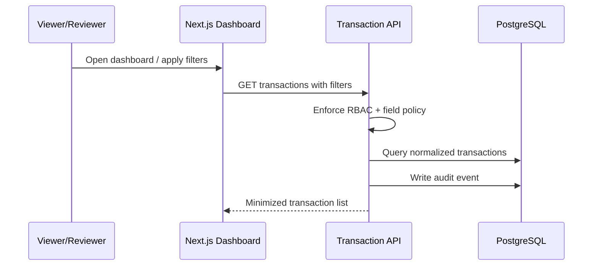
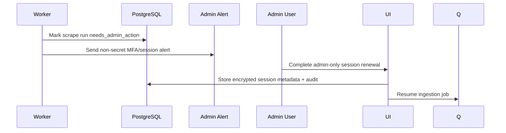

# Design: Transaction Dashboard MVP

## Technical Approach

Build RD-Sync as a private **Next.js/TypeScript modular monolith** for dashboard, API, RBAC, audit, and operations screens, plus a separate Node worker for Playwright scraping. Both processes share PostgreSQL. Use **Prisma** for MVP schema, migrations, and type-safe CRUD; Drizzle is lighter and SQL-first, but Prisma is faster for first scaffold and relational iteration. Use **BullMQ + Redis** for scheduled ingestion, retries, pause/resume, and admin intervention; a DB-only scheduler is simpler but weaker for backoff and worker isolation. ERP integration and reconciliation stay out of scope.

## Architecture Decisions

| Decision | Choice | Rationale |
|---|---|---|
| Read-only bank boundary | Scraper adapter only reads transaction pages; no transfer/payment selectors or flows exist in code. | The safest system is the one that cannot perform money movement. |
| Admin-only MFA | Worker pauses with `needs_admin_action`; only admins can renew sessions. | Employees get transaction data, not bank access. |
| Normalized records | Store canonical transaction rows with optional bank fields. | Dashboard remains stable even when bank-specific fields vary. |
| Audit logging | Record dashboard views, review updates, scrape runs, admin actions, and denied access. | Accountability is mandatory around financial data. |
| Data minimization | No balances, credentials, raw screenshots, tokens, or unrelated account data by default. | Reduces blast radius and employee overexposure. |
| Scraper isolation | Separate worker process, encrypted secrets/session state, safe diagnostics. | Browser automation is brittle and must not contaminate UI/API trust boundaries. |
| Idempotency | Unique `sourceHash` from bank/account/date/amount/reference/concept where available. | Re-runs must not duplicate transactions. |

## Data Flow

```mermaid
sequenceDiagram
  participant Q as BullMQ
  participant W as Scraper Worker
  participant B as Bank Portal
  participant DB as PostgreSQL
  participant A as Alerts/Audit
  Q->>W: Run ingestion job
  W->>B: Read transaction table only
  B-->>W: Recent rows
  W->>DB: Upsert normalized transactions + scrape run counts
  W->>A: Audit success/failure; alert on safe error
```





## File Changes

| Future path | Action | Description |
|---|---|---|
| `package.json` | Create | Next.js, TypeScript, Prisma, Playwright, BullMQ, Redis, test tooling. |
| `prisma/schema.prisma` | Create | Users, roles, transactions, scrape runs, audit events, encrypted session refs. |
| `src/app/(private)/transactions/page.tsx` | Create | Employee transaction dashboard. |
| `src/app/api/transactions/route.ts` | Create | Filtered read API with audit. |
| `src/app/api/transactions/[id]/review/route.ts` | Create | Reviewer state update API. |
| `src/app/admin/scrape-runs/page.tsx` | Create | Admin-only operational/MFA intervention view. |
| `src/modules/{auth,audit,transactions}/` | Create | RBAC, audit, domain, repositories. |
| `src/worker/{queues,scraper}/` | Create | BullMQ jobs, Playwright adapters, normalization. |

## Interfaces / Contracts

- `TransactionRecord`: `id`, `bankId`, `accountFingerprint`, `postedAt`, `amount`, `currency`, `direction`, optional `reference`, `concept`, `originator`, `reviewState`, `reviewedBy`, `scrapeRunId`, `sourceHash`.
- `ScrapeRun`: `id`, `bankId`, `status` (`queued|running|succeeded|failed|needs_admin_action`), timestamps, inserted/skipped counts, safe error summary.
- `AuditEvent`: actor/system id, role, action, target, timestamp, redacted metadata.
- Roles: `admin` manages bank sessions/jobs; `reviewer` reads and marks review state; `viewer` reads only.

## Testing Strategy

| Layer | What to test | Approach |
|---|---|---|
| Unit | normalization, hash/idempotency, RBAC, redaction | Vitest after scaffold. |
| Integration | Prisma constraints, filters, audit writes, queue transitions | Disposable PostgreSQL/Redis. |
| E2E | dashboard filters, denied employee scraper access, admin MFA path | Playwright browser tests. |

Enable **Strict TDD** once the stack and test runner exist; no runner is present yet.

## Migration / Rollout

No migration now. First implementation creates initial schema and seeds admin/reviewer/viewer roles. Roll out with scraper disabled until credentials, read-only bank user, secret provider, and alert channel are configured.

## Open Questions

- [ ] Confirm first target bank, read-only account permissions, secret provider, and admin alert channel.
